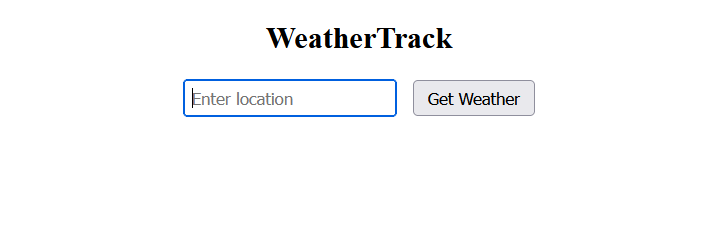
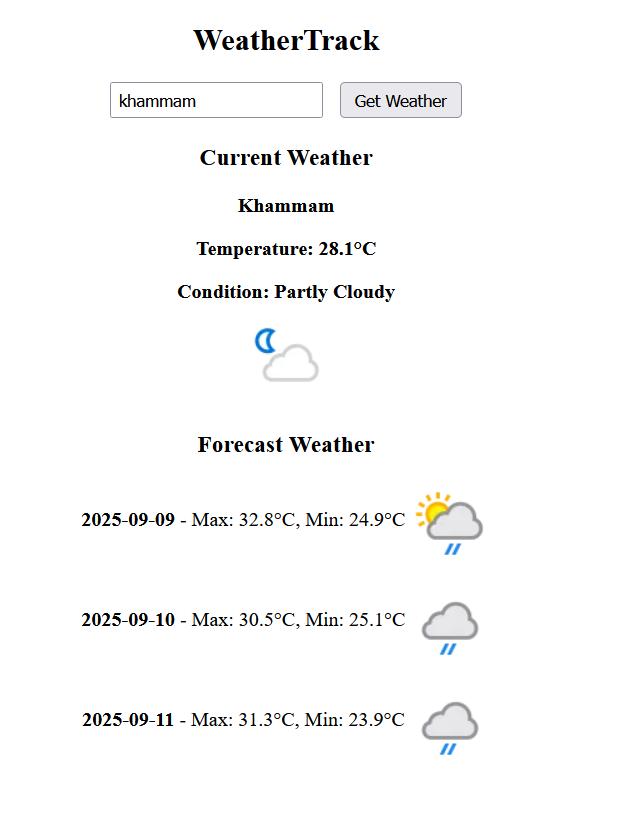

# 🌦 WeatherTrack-RealTime

A simple weather **project** built using **HTML**, **CSS**, and **JavaScript** that fetches **real-time weather data** and provides a **3-day forecast** using the **WeatherAPI**.

Live Demo: [WeatherTrack-RealTime](https://saitejavurukonda.github.io/WeatherTrack-RealTime/)

---

## 🚀 Features
- 🌍 Search weather by location name  
- 📅 Displays current weather and a 3-day forecast  
- 🌡 Temperature in Celsius  
- 💨 Shows wind speed and humidity  
- 📱 Fully responsive design  

---

## 🛠 Tech Stack
- **HTML** – Structure  
- **CSS** – Styling  
- **JavaScript (Fetch API)** – Fetching and displaying data  
- **WeatherAPI** – Real-time weather data  

---

## 📸 Screenshot
  
  

---

## 📂 Installation / Usage
```bash
git clone https://github.com/Saitejavurukonda/WeatherTrack-RealTime.git
cd WeatherTrack-RealTime
# Open index.html in your browser
````

---

## 📖 How It Works

* Enter a location name in the search bar
* App fetches real-time data from WeatherAPI
* Displays current weather + 3-day forecast

---

## 🔮 Future Improvements

* 🌑 Dark mode
* ⏰ Hourly forecast
* 📍 Auto-detect location (geolocation)
* 🌐 Fahrenheit support
* 📊 Temperature trend graphs

---

## 🙌 Acknowledgements

* [WeatherAPI](https://www.weatherapi.com/) for free weather data
* Open-source community tutorials for API integration inspiration

```

